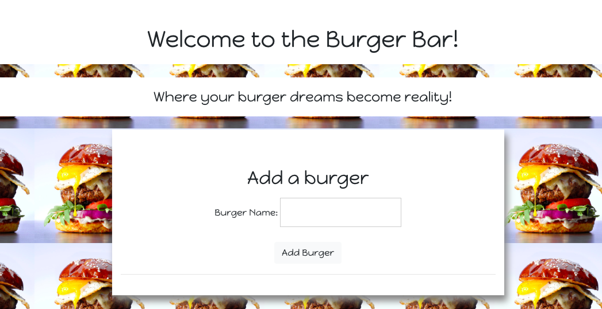
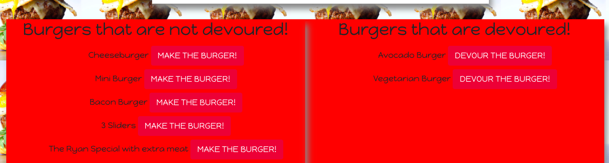
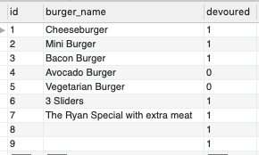

# Burger Shop
## A shop for those who want the best burgers, the fastest

### Created By Christie Byrne

### Try it out at https://pacific-castle-73600.herokuapp.com/!

# Purpose of the App
A full stack, MVC (Model-View-Controller) application that allows you to create burgers (POST), view a list of burgers available to eat (GET) and update the status (PUT) once the burger has been eaten. It is built with MySQL, Node, Express, Handlebars and an ORM.

## Getting Started
Here is how to set up this application and get it running locally on your computer.

### Clone the repository
 * The first step is to clone the project repository to a local directory on your computer. To clone the repository, run the following commands:

        git clone git@github.com:byrnec/burger.git
        cd burger
* After you clone the repository, navigate to the project root directory (burger). 

### Install Node.js

 * you can install the latest version here: https://nodejs.org/en/.

### Install the dependencies
* The following npm packages are dependencies to the project.

    run  `npm install`

    express - a Node.js web application framework (https://www.npmjs.com/package/express).
        
    body-parser - used to parse incoming request bodies in a middleware. (https://www.npmjs.com/package/body-parser)
        
    mysql - used to create a connection to the MySQL database via the command line.(https://www.npmjs.com/package/mysql)

    express-handlebars - allows you to use handlebars to create templates to build the HTML.
        (https://www.npmjs.com/package/express-handlebars)

### Install MySQL Workbench
* you can install the latest version here: https://www.mysql.com/products/workbench/

### Set up a development database
* To set up a development database that you can use with this application, perform the following steps:

* Open the db/schema.sql file and paste the contents of this file into MySQL Workbench.

* Run these SQL commands

                CREATE DATABASE burger_db;
                USE burger_db;
  
Running these statements creates a database called burger_db and sets it as the current database being used.

Execute the following statement to create a table called burgers.

            CREATE TABLE burgers
                (
                    id int NOT NULL AUTO_INCREMENT,
                    burger_name varchar(255) NOT NULL,
                    devoured boolean NOT NULL,
                    PRIMARY KEY (id)
                );
  
* This table includes columns for id (which is the primary key), burger name, and devoured (boolean value).

* open up the db/seeds.sql file and paste the contents into MySQL Workbench. Execute the code in seeds.sql from MySQL Workbench:

        INSERT INTO burgers (burger_name, devoured) VALUES ("Bacon Cheeseburger", true);
        INSERT INTO burgers (burger_name, devoured) VALUES ("Avocado Burger", false);
        INSERT INTO burgers (burger_name, devoured) VALUES ("Three sliders", true);

Your table should look like this:

### Verify database connection information
            
### Start the server
* run the following command to start the server:

            node server.js
* To ensure that the server has started and the application is working locally on your computer, open Chrome and go to http://localhost:3000.

 ## Backend technologies
* Node.js (https://nodejs.org/en/)
* MySQL (https://www.mysql.com/)
* Express (http://expressjs.com/)
* ORM - Object Relational Mapping (https://en.wikipedia.org/wiki/Object-relational_mapping)

## Frontend technologies
* HTML
* CSS
* Bootstrap (http://getbootstrap.com/)
* Javascript
* jQuery (https://jquery.com/)
* Handlebars (http://handlebarsjs.com/)
    